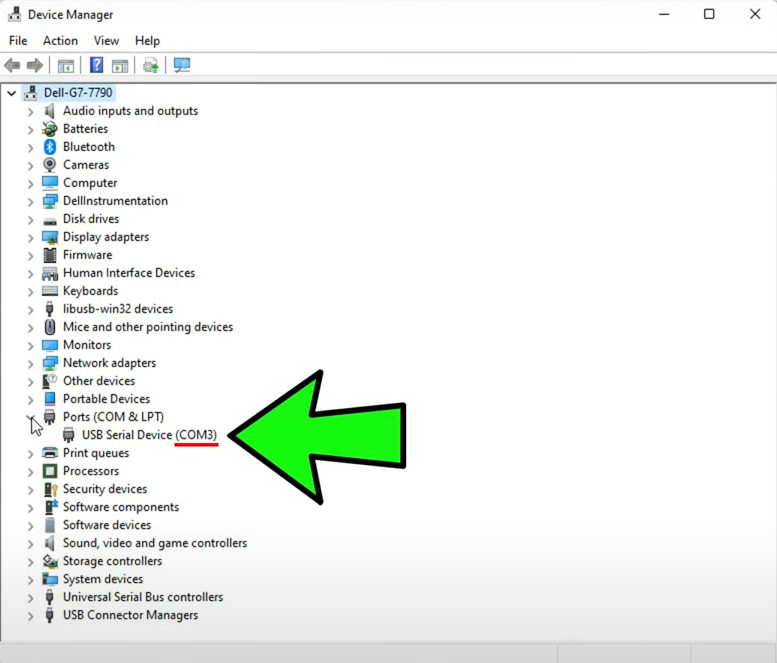
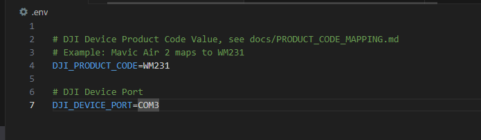

# Gimbal Calibration Instructions

Watch this video: https://youtu.be/mu03HWXplM4

1. Plug your DJI device to your computer
2. Find your DJI device's port via Device Manager.
    - In the example below, the port is COM3.

3. Find your DJI device's product code. Refer to [PRODUCT_CODE_MAPPING.md](docs/PRODUCT_CODE_MAPPING.md) for your DJI device's product code.
    - For example, if your DJI device is a Mavic Air 2, then your product code is WM231.
4. In [.env](../.env), set the DJI_PRODUCT_CODE to the DJI device product code found in Step 3. Set DJI_DEVICE_PORT to the value found in Step 2.

